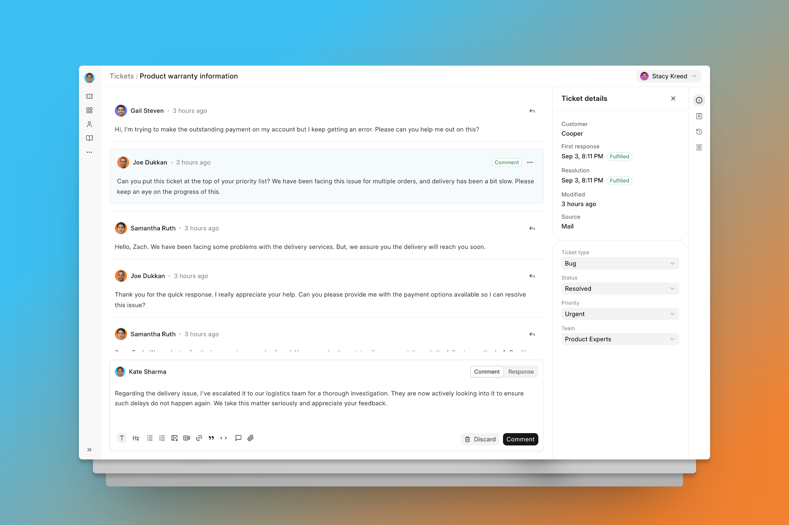

<div align="center" markdown="1">
	<a href="https://frappedesk.com/">
		
	</a>
	<h2>Westronet Helpdesk</h2>
	<p align="center">
	<p>Modern, Streamlined, Customer Service Software</p>
	</p>
  
[Westrodesk.com](https://westrodesk.com)


---

Westronet Helpdesk offers an easy setup, clean user interface, and automation tools to resolve customer issues efficiently. It is based on Frappe Framework. It lets you streamline your company's support and helps you to efficiently manage your customer queries. It can help you to,

-   Create tickets from email or help center
-   Empower customers with a comprehensive knowledge base and self-service portal
-   Automate redundant tasks like agent assignment and set up triggers to notify agents and customers based on certain events



## Installation

2. In the bench directory, run `bench start` and keep it running
3. Open another terminal in bench directory, and run these commands

	```
	bench get-app helpdesk
	bench new-site helpdesk.test
	bench --site helpdesk.test install-app helpdesk
	bench --site helpdesk.test add-to-hosts
	```

	You can now access Helpdesk at `http://helpdesk.test`
5. You can also run a development server by following theses steps, in Helpdesk
   directory (`apps/helpdesk`)

   ```
   yarn
   yarn dev
   ```

   Development server will be now available at `http://localhost:8080`


